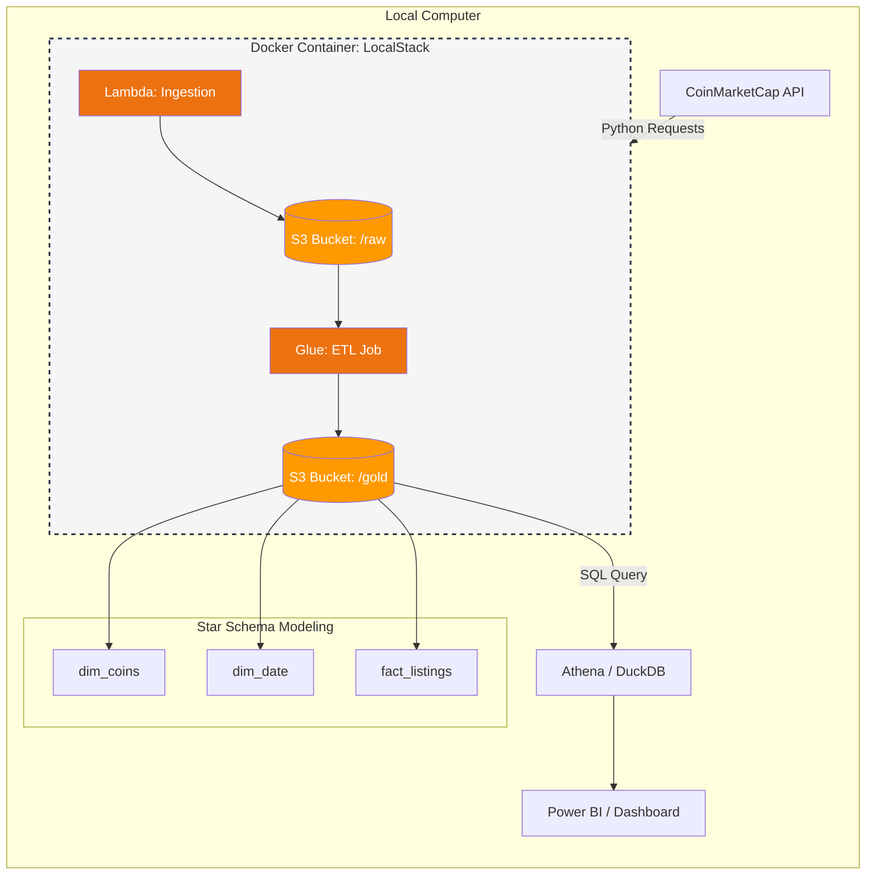

# Project Background

## Overview

Using CoinMarketCap's API, I built an automated pipeline that extracts cryptocoins and its details by calling the API, saving them into JSON files, viewed in the `data/raw` folder. They are then transformed and saved as a parquet, viewed in the `data/processed` folder. Percentage changes and volumes within 24 hours moving ranges are calculated onto a dashboard.

