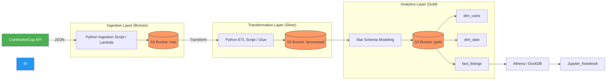

# Project Background

## Overview

Using CoinMarketCap's API, I built an automated pipeline that extracts cryptocoins and its details by calling the API, saving them into JSON files, viewed in the `data/raw` folder. They are then transformed and saved as a parquet, viewed in the `data/processed` folder. Percentage changes and volumes within 24 hours moving ranges are calculated onto a dashboard.



## Technical Stack
I used the following tools and languages to build this pipeline:
* **Cloud Infrastructure (Mock):** LocalStack (AWS S3)
* **Containerization:** Docker & Docker-Compose
* **Data Ingestion:** Python (CoinMarketCap API)
* **Data Processing:** Pandas & Apache Parquet
* **Data Warehouse/OLAP:** DuckDB
* **Orchestration (Planned):** Apache Airflow
* **Visualization:** Matplotlib & Jupyter Notebooks

---

## Data Architecture
Using the Medallion Pattern, I structured the pipeline into three layers to ensure data quality and lineage:

| Layer | Type | Description |
| :--- | :--- | :--- |
| **Bronze** | Raw Data | Ingested JSON payloads directly from the CMC API stored in S3. |
| **Silver** | Cleaned Data | Data is flattened, schema-mapped, and converted to Parquet for efficient storage. |
| **Gold** | Curated Data | Dimensional modeling with Fact and Dimension tables for analytics. |

### Star Schema Design
The **Gold Layer** is modeled as follows:
* **fact_listings**: Contains metrics like `price_usd` and `market_cap`.
* **dim_coins**: Contains descriptive attributes like `coin_name` and `ticker`.
* **dim_date**: Enables time-series analysis with granularity up to the minute.

---

## Pipeline Workflow 
1.  **Ingestion:** Python scripts pull the latest market data and push it to the Bronze S3 prefix.
2.  **Transformation (Bronze → Silver):** Raw JSON is cleaned, nulls are handled, and data is partitioned.
3.  **Modeling (Silver → Gold):** Data is joined and normalized into the final schema.
4.  **Backfilling:** Historical data is integrated using the `yfinance` library to provide 1-year performance context.

---

## Prerequisites
* Docker and Docker-Compose installed.
* A valid CoinMarketCap API Key via this [here](https://coinmarketcap.com/api/).

### Steps
Down below are the steps to recreate this project:

1. **Clone the repository:**
   ```bash
   git clone [https://github.com/yourusername/marketcap-crypto-analysis.git](https://github.com/yourusername/marketcap-crypto-analysis.git)
   cd marketcap-crypto-analysis

2. **Configure Environment Variables:** Create a `.env` file in the root directory:
   ``` markdown
   CMC_API_KEY=your_key
   S3_BUCKET=crypto-raw-data
   LOCALSTACK_ENDPOINT=[http://127.x.0.1:4566](http://127.x.0.1:4566) -> follow the api's documentation https://hub.docker.com/r/localstack/localstack.
   AWS_ACCESS_KEY_ID=test
   AWS_SECRET_ACCESS_KEY=test
3. **Start Docker:**
   ``` bash
   docker-compose up -d
4. **Create an S3 Bucket:**
   ``` bash
   awslocal s3 mb s3://crypto-raw-data
5. **Execute the pipeline scripts:**
   ``` bash
   python src/ingestion/ingest_and_save_bronze.py
   python src/transformation/transform_bronze_to_silver.py
   python src/transformation/transform_silver_to_gold.py

---

## Analytical Insights

The pipeline I have created visualizes market trends through the exploration.ipynb notebook, showing top 10 cryptocoins through a dynamic horizontal bar charts showing market cap leaders a percentage growth chart with normalized lines comparing performance (e.g., BTC vs. ETH) over a 12-month period.
